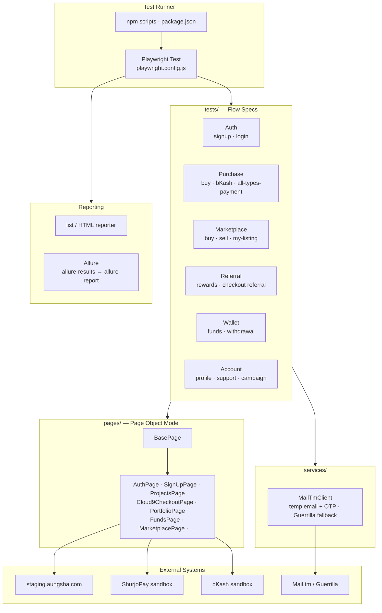

# Aungsha Automation Test

End-to-end Playwright automation for the Aungsha real estate FinTech platform (staging).

Watch the recorded executions of all automated flows in the public Google Drive folder:

**[View All Automation Flow Videos](https://drive.google.com/drive/folders/1K-MJ-Z_h0eJSgmpR3jANx9NWWAkXFc15?usp=sharing)**

---

## Architecture



### Layer summary

| Layer | Path | Role |
|-------|------|------|
| Config | `playwright.config.js` | baseURL, headed/headless, Allure, Chromium path |
| Specs | `tests/*.spec.js` | Business flows (thin — call pages) |
| Pages | `pages/*.js` | Locators + actions (POM, extends `BasePage`) |
| Services | `services/` | Shared helpers (temp mail / OTP) |
| Scripts | `scripts/` | Browser install to `.playwright-browsers` |
| Docs | `FLOW-DOCUMENTATION.md` | Flow runbook + checkpoints |

### Design rules

- **POM + OOP** — locators stay inside page classes; specs stay thin
- **Staging target** — `https://staging.aungsha.com`
- **Payments** — ShurjoPay, bKash, Fund Balance sandboxes via `Cloud9CheckoutPage`
- **Reports** — Playwright HTML + Allure (`npm run allure:report`)

### Quick start

```powershell
Set-Location 'E:\Test'
npm.cmd install
npm.cmd run browsers:install
# set AUNGSHA_EMAIL / AUNGSHA_PASSWORD (and payment env as needed)
npm.cmd run all-types-payment-method
npm.cmd run allure:report
```

Full flow inventory and commands: see [`FLOW-DOCUMENTATION.md`](./FLOW-DOCUMENTATION.md).
